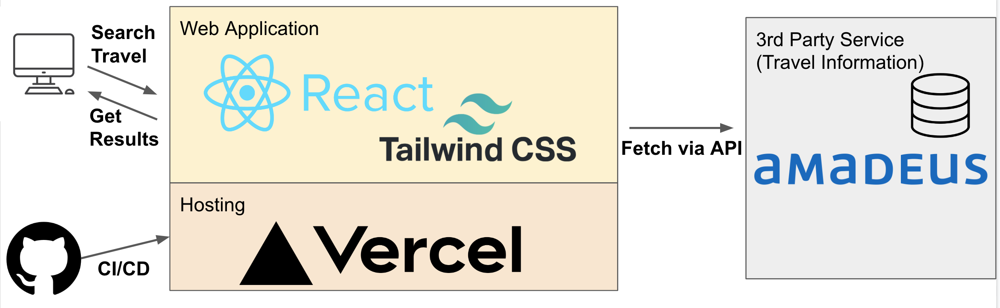

# Travel App

## What is this?
- Web Application

## Stacks
- React 18.2.0
- TailwindCSS 3.2.4

## Infra (Hosting Service)
- Vercel

## 3rd Party Service
- Amadeus
  - What is Amadeus?
    - A travel technology company 
    - They build the critical solutions that help airlines and airports, hotels and railways, search engines and so on.
  - In this application, using the below API
    - [Self-Service APIs](https://developers.amadeus.com/)

## When use?
- Use this app, when you travel with airplane.
  - If you plan to travel, you must decide a destination and find a flight.
  - Sometimes this is boring.
  - So this app help you.

## Features
- Fingd Flight offers
  - Input search condintions (deperture/destination airport, departure date, how many adults, and currency code)
  - System find and show some flight offers.
  - You can get ` Airline Code`, `Information Source`,  `Total Price`, `IATA Code`, `Departure Date` and `Currency Code`.

## Demo
### Demo URL
- Please this [Demo URL](https://travel-223fbnxya-yuta520.vercel.app/)
### Demo Moview
- The way to look for airline offers


## Architecture


## How to setup
### Create Amadeus account to use API
- [References](https://developers.amadeus.com/get-started/get-started-with-self-service-apis-335)

### Prepare the application
1. Clone the repository
```bash
git clone https://github.com/yuta519/airline_reservation_app.git
cd airline_reservation_app
```
2. Install dependencies
```bash
yarn install
```

3. Create environment variables
- Use below command on Mac or Linux
```bash
cat << EOT >> .env
REACT_APP_AMADEUS_KEY=<Your Amadeus API Key>
REACT_APP_AMADEUS_SECRET=<Your Amadeus API Secret>
EOT
```
- Or make .env file manually.

4. Run the application
```bash
yarn start
```

## Struggles
- Learn how to use Amadeus API
  - Whenever we use 3rd party API, we have to learn documentations.
  - By services, docs are different and need to learn.
- Implement Responsible design with Tailwind css
  - I hadn't experienced responsible designs with Tailwind CSS.

## Next Challenges
- Booking feature
  - Current app can only search flights.
  - So as next step I will add a booking feature.
